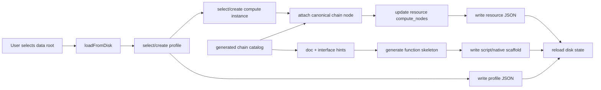

# 02 Architecture

## Architecture Intent

The port should turn Chain Assembly into a usable `计算链路组装` board.

The board integrates three layers:

- authoring UX: guide the user through profile, compute instance, chain node, and scaffold steps
- generated resources: write configuration profiles, resource metadata, and implementation scaffolds
- documentation intelligence: use chain-contract docs/catalog to explain nodes and generate interface skeletons

The target architecture is:

- current Electron desktop app owns shell, file IO, and workbench layout
- Chain Assembly owns data-root and `.tinder` directory operations
- standard resource JSON files own resource-chain metadata
- generated chain catalog owns canonical chain-node choices
- generated profiles own reusable configuration档案
- implementation scaffold files own generated or user-edited functions
- the legacy GUI is used as behavior reference only

## Current App Boundary

Current Chain Assembly has these responsibilities:

- select `dataRoot`
- ensure `.tinder` folder structure exists
- load profiles from `.tinder/profiles`
- load standard resources from `.tinder/resources/standard`
- load custom resources from `.tinder/resources/custom`
- read/write resource and profile JSON files through `window.tinder`
- generate or update implementation files through `window.tinder.writeText`

The existing disk state is:

```ts
interface DiskState {
  profiles: ProfileEntry[];
  standardTree: TreeNode<PlatformResourceInstance>[];
  customTree: TreeNode<CustomNodeConfig>[]; // current baseline; target becomes TreeNode<CustomResourceInstance>[]
  extras: Record<string, ProfileExtras>;
  paths: {
    tinderDir: string;
    profilesDir: string;
    standardDir: string;
    customDir: string;
  };
}
```

## Legacy GUI Boundary

The old GUI edited a single in-memory `GuiProjectFile`.

Important legacy shape:

```ts
interface PlatformResourceInstance {
  resource_instance_id: string;
  display_name: string;
  description?: string;
  location?: string;
  impl_kind?: "python_script" | "cpp_dylib";
  compute_nodes: PlatformComputeNode[];
}

interface PlatformComputeNode {
  node_id: string;
  display_name: string;
  node_type: PlatformNodeType;
}
```

Important legacy behavior:

- resource cards summarized chain IDs, compute node names, file location, and description
- detail panel edited `compute_nodes`
- add-node preferred the currently selected core chain when one was selected
- chain-node choices came from `CORE_CHAIN_IDS`

## Storage Decision

The port must not keep the legacy assumption that all resources live inside `project.platform_resources`.

In the current app:

- each standard resource leaf is a separate resource file
- editing a selected resource updates that leaf file
- profiles may reference resources, but profiles do not own chain metadata

This keeps resource definitions reusable across profiles and prevents profile-specific duplicates.

## Profile View Decision

The profile tree uses four direct child views:

- `链路`
- `活跃资源`
- `停用资源`
- `使用与版本`

`概览` is intentionally not used as the label because the status-summary content belongs mostly in `链路`. `使用与版本` is profile lifecycle management:

- current profile path
- save and Save As
- version/revision metadata
- usage by simulation objects
- tags and applicability
- copy/derive profile actions

## Source Of Truth Decision

`活跃资源` and `停用资源` are the source of truth for compute-instance editing in the selected profile.

`链路` is a projection:

- groups by canonical compute node
- shows covered/missing/disabled/multi-implemented states
- provides shortcut actions to create or bind resources
- writes the resulting changes back to profile/resource records

No chain-specific shadow storage should be introduced for the same activation relationship.

## Activation Model

There are two activation layers:

```text
Configuration profile -> standard resource variant or custom resource
Standard resource -> candidate compute-node capabilities + model variants
```

Profile-level resource management:

```json
{
  "resources": [
    {
      "kind": "standard",
      "resource_instance_id": "radar-main",
      "variant_id": "radar_a",
      "enabled": true,
      "folder": "雷达/主雷达"
    },
    {
      "kind": "standard",
      "resource_instance_id": "radar-backup",
      "variant_id": "radar_b",
      "enabled": false,
      "folder": "雷达/备用"
    },
    {
      "kind": "custom",
      "resource_instance_id": "preprocess-hook",
      "enabled": true,
      "folder": "流程扩展/预处理"
    }
  ],
  "custom_node_usages": [
    {
      "resource_instance_id": "preprocess-hook",
      "node_id": "normalize-input",
      "enabled": true,
      "insert_before": {
        "kind": "builtin_core_chain",
        "chain_id": "P-01"
      },
      "order": 0
    }
  ]
}
```

Interpretation:

- `enabled: true` renders the standard resource variant or custom resource under `活跃资源`
- `enabled: false` renders the standard resource variant or custom resource under `停用资源`
- `folder` is a profile-local virtual folder path
- both standard variant refs and custom resource refs render under the same `活跃资源` / `停用资源` groups
- standard refs may be visually grouped by `resource_instance_id`, but the profile participation unit is `resource_instance_id + variant_id`
- activating/stopping a profile ref changes `resources[].enabled`; it does not move or delete the resource file
- custom node participation and placement are profile-owned in `custom_node_usages[]`; custom resource files only define reusable node capabilities
- global `计算实例` entries are available through `加入档案` or drag/drop; they do not automatically fill `停用资源`

`加入档案` semantics:

- adds an existing standard resource variant or custom resource reference to the selected profile's `resources[]`
- does not create resource JSON
- does not modify the resource JSON unless the user subsequently edits the resource
- does not export runtime config
- defaults `enabled` from the entry point:
  - invoked from `活跃资源`: `enabled: true`
  - invoked from `停用资源`: `enabled: false`

Drag/drop semantics:

- dragging a standard variant or custom resource from `计算实例` to `活跃资源` adds it to `resources[]` with `enabled: true`
- dragging a standard variant or custom resource from `计算实例` to `停用资源` adds it to `resources[]` with `enabled: false`
- dropping onto a virtual subfolder sets `resources[].folder`
- if the resource already exists in `resources[]`, the drop updates `enabled` and `folder` rather than creating a duplicate ref

`计算实例` scope:

- the user-facing tree node is `计算实例`
- `计算实例` functions as the global resource-instance metadata library
- the draggable item is a resource-instance metadata record loaded from `.tinder/resources/**`
- the metadata record may point to an implementation file through `location`
- `.py`, `.dll`, and source files are not draggable `计算实例` entries
- implementation files are selected through explicit load/associate controls when editing a resource instance
- there is no direct `.py`/`.dll` drop-to-profile behavior in this task

`计算实例/标准`:

- loaded from `.tinder/resources/standard/**/*.json`
- uses `PlatformResourceInstance`
- owns `compute_nodes[]`
- `compute_nodes[].node_id` targets the current canonical standard chain node catalog generated from `docs/flowchat/chain-contract`
- maps to runtime `builtin_core_chain` coverage and standard chain assembly state

`计算实例/自定义`:

- loaded from `.tinder/resources/custom/**/*.json`
- uses custom compute-instance metadata
- does not own `compute_nodes[]`
- owns `custom_nodes[]`; each child node is an independently placeable execution unit
- participates in profile `resources[]` exactly like a standard resource ref
- maps to runtime `custom_nodes[]` and `ordered_execution_list[]` entries of kind `custom_invocation_node`
- each profile-enabled custom node usage can be freely inserted before, between, or after generated built-in execution items while preserving builtin standard-chain order
- is shown separately from standard chain coverage
- is excluded from runtime export when its profile resource ref is under `停用资源`

Recommended custom resource shape:

```ts
interface CustomResourceInstance {
  resource_instance_id: string;
  display_name: string;
  description?: string;
  module_id: string;
  impl_kind: "python_script" | "cpp_dylib";
  location: string;
  custom_nodes: CustomComputeNode[];
}

interface CustomComputeNode {
  node_id: string;
  display_name: string;
  description: string;
  status?: "available" | "disabled" | "deprecated";
  action_index: number;
  handler_function?: string;
  default_parameters?: Record<string, string>;
}
```

## Custom Execution Placement

Model-P-v2 stores the executable order as `ordered_execution_list`. Runtime validation accepts `custom_invocation_node` items anywhere in that list, but rejects missing, extra, or reordered built-in items.

The current app should not make the full built-in list the only authoring source of truth, because the standard chain catalog can change. Profile authoring should store only custom placement metadata and generate the complete runtime list from the current catalog when saving/exporting runtime config.

Recommended profile-owned authoring field:

```ts
interface CustomNodeUsage {
  resource_instance_id: string;
  node_id: string;
  enabled: boolean;
  insert_before?: BuiltinExecutionAnchor | null;
  order: number;
}

type BuiltinExecutionAnchor =
  | { kind: "builtin_domain_node"; domain: string; node_id: string }
  | { kind: "builtin_core_chain"; chain_id: string };
```

Generation algorithm:

1. Build the current canonical built-in execution list from docs/catalog.
2. Read active custom resource refs from `resources[]`.
3. Expand each active custom resource through profile `custom_node_usages[]`.
4. Group custom placements by `insert_before`; use `null` for append-after-last.
5. Emit each built-in item, first inserting custom items whose `insert_before` targets that built-in item.
6. Append custom items whose `insert_before` is `null`.
7. Emit flat runtime `custom_nodes[]` from the active child custom nodes referenced by the final order.

Runtime flattening:

- `custom_node_id`: `${resource_instance_id}.${node_id}`
- `module_id`, `impl_kind`, `location`: copied from the custom resource
- `display_name`, `node_id`, `action_index`: copied from the custom node definition
- runtime `enabled`: derived from profile `custom_node_usages[].enabled` and resource `custom_nodes[].status`
- runtime invocation parameters are not copied per custom node; they are supplied by engine initialization through `InitCustomResourceParameters(resource_instance_id, parameters)`
- `ordered_execution_list[]`: references the flattened `custom_node_id`

Migration behavior:

- if the referenced built-in anchor is still present, preserve placement
- if the anchor disappeared or changed identity, show the placement as unresolved and keep the custom resource in the profile
- unresolved placement should not silently disappear; it can default to append-after-last only after an explicit migration/save decision

## Custom Node Editing UX

Custom editing uses three conceptual layers:

```text
Resource instance layer -> what implementation/module this custom resource is
Node capability layer   -> which custom compute nodes it exposes
Chain placement layer   -> where profile-enabled custom node usages execute
```

`活跃资源` / `停用资源` own the first two layers. Selecting a custom resource opens a resource detail panel with:

- resource header: name, description, `module_id`, `impl_kind`, `location`, implementation file status
- custom node list: display name, `node_id`, `action_index`, capability status, profile usage state, placement state, validation state
- selected node details: description/summary, `action_index`, resource-local handler function, default parameters metadata, placement selector, interface-generation action, test invocation action when available

`链路` owns the placement layer:

- standard built-in items are read-only anchors
- custom nodes, not whole custom resources, are draggable/insertable
- available custom nodes are grouped by source resource
- placement can be changed by drag/drop or by commands such as `放入链路`, `移到...`, and `移出链路`
- a searchable placement selector is required so precise placement does not depend only on drag/drop

Node creation flow:

1. User chooses `新增自定义节点` under a custom resource.
2. UI asks for display name and a required description/summary.
3. UI proposes `node_id`.
4. UI allocates a globally unique `action_index`.
5. UI proposes a resource-local `handler_function`.
6. User optionally edits default parameter metadata for documentation/init-template use.
7. User chooses whether to generate/update the shared custom interface.
8. User chooses whether to place the node now or leave it `未编排`.

Custom node states:

- `未编排`: profile-enabled usage but no placement
- `已编排`: profile-enabled usage and has valid placement
- `停用`: profile-disabled usage or unavailable/deprecated resource capability excluded from runtime export
- `异常`: invalid `action_index`, default parameter metadata, location, or placement

## Standard Resource Editing UX

Standard resources are capability declarations against the generated standard chain catalog. They do not own execution placement.

Normal editing layout:

```text
Left: standard node capability list for the selected resource
Right: selected node detail, documentation, validation, and interface generation
```

Resource metadata is shown in a compact header or right-panel resource section:

- name
- description
- `impl_kind`
- `location`
- implementation-file status
- interface-generation status

Capability list rows show:

- display name
- canonical `node_id`
- capability status
- interface-generated state
- current-profile coverage state

Selected capability detail shows:

- doc summary from the generated chain catalog
- `node_id`, display name, node type, capability status
- implementation function/interface status
- actions: enable/disable, remove capability, generate/update interface

Add/bind flow can temporarily use three columns:

```text
Left: current resource capability list
Middle: searchable standard chain catalog / candidate nodes
Right: selected catalog node docs and interface preview
```

The `链路` view can also use three columns because it spans the profile:

```text
Left: standard chain backbone plus custom slots
Middle: resource coverage/candidates
Right: selected node/resource detail and actions
```

Boundary:

- standard execution order is generated from the current standard chain catalog
- users cannot reorder standard nodes
- standard resource editing only declares capability membership, version enablement, and applicability/model scope

## Standard Coverage And Applicability

Standard resources describe capabilities for a model/scope, not a concrete runtime device instance. A concrete device ID is unavailable during authoring because it is assigned after simulation starts.

Recommended applicability shape:

```ts
interface ResourceApplicability {
  scope:
    | "device_model"
    | "platform_model"
    | "platform_instance"
    | "environment_service"
    | "signal_service"
    | "global";
  model_id?: string;
}
```

Recommended standard resource shape:

```ts
interface PlatformComputeNode {
  compute_node_id: string;
  node_id: string;
  display_name: string;
  node_type: PlatformNodeType;
  version_id?: string;
  function_name?: string;
  base_function_name?: string;
  status?: "available" | "disabled" | "deprecated";
}

interface ResourceModelVariant {
  variant_id: string;
  display_name: string;
  applicability: ResourceApplicability;
  selections: Array<{
    node_id: string;
    compute_node_id: string;
  }>;
}
```

Coverage semantics:

- model variants can be created manually first; imported variants and sync validation can be added later
- new standard resources may create an initial variant automatically, but every variant must bind an explicit applicability scope
- `复制变体` creates a new independent `variant_id` and deep-copies applicability plus selections from the source variant
- copied variants are snapshots, not inherited variants; no parent pointer, override layer, or automatic upstream sync is stored in MVP
- copied names/IDs should be generated deterministically and remain editable before save
- `default` is an explicit service/global variant name, not an unbound variant
- one resource can target multiple standard chain nodes
- one standard chain node can be covered by multiple resources
- one standard chain node can be covered by multiple compute-node candidates when applicability/model scope differs
- one resource can store multiple candidate versions for the same standard chain node
- one resource can define multiple model/variant configs such as `radar A` and `radar B`
- unselected candidates are legal and do not imply missing coverage
- candidate versions may share one implementation function name; shared-function dispatch rules are outside this package
- linking a resource to a standard chain node must carry the target model/variant config
- for the same resource variant and same standard `node_id`, only one candidate may be selected
- duplicate selected candidates for the same variant + `node_id` are validation errors
- disabled candidates cannot be selected by a variant
- configuration profiles include only participating standard resource variants, not every variant under a selected resource
- runtime startup resolves model-scoped resource capabilities to concrete device IDs later

Standard resource UI implications:

- show a model/variant switcher such as `型号配置: radar A`
- show an `适用对象` area for the selected variant
- support `复制变体`
- do not expose `device_id` as an authoring field
- capability rows should show model/scope and version where relevant
- if a resource has multiple versions for the same chain node, show them grouped under that chain node
- in one group, the UI should make the selected/effective candidate explicit for the current variant
- switching variants changes which candidate is effective without duplicating the resource
- use grouping, filtering, and buckets for unselected candidates instead of surfacing them as missing coverage
- `链路` projection should summarize coverage by standard chain node and applicability/model scope

Standard chain node level metadata:

```ts
type ApplicabilityScope =
  | "device_model"
  | "platform_model"
  | "platform_instance"
  | "environment_service"
  | "signal_service"
  | "global";

interface StandardChainNodeMeta {
  node_id: string;
  display_name: string;
  provider_level: "l3_service" | "platform_model" | "device_model" | "global";
  allowed_applicability_scopes: ApplicabilityScope[];
}
```

This metadata lets UI and validation distinguish L3 platform/environment/signal service providers from L4 device-model providers.

Resource-level capability activation:

```json
{
  "compute_nodes": [
    {
      "compute_node_id": "entity-update-v1",
      "node_id": "platform.entity.update",
      "display_name": "实体维护",
      "node_type": "switch",
      "version_id": "v1",
      "enabled": true
    },
    {
      "compute_node_id": "entity-update-v2",
      "node_id": "platform.entity.update",
      "display_name": "实体维护 B",
      "node_type": "switch",
      "version_id": "v2",
      "enabled": true
    }
  ],
  "model_variants": [
    {
      "variant_id": "radar_a",
      "display_name": "Radar A",
      "applicability": {
        "scope": "device_model",
        "model_id": "radar_a"
      },
      "selections": [
        {
          "node_id": "platform.entity.update",
          "compute_node_id": "entity-update-v1"
        }
      ]
    }
  ]
}
```

Effective chain coverage is true only when:

```text
profile resource ref is enabled
AND resource compute node capability status is available
AND selected resource variant matches the target applicability/model scope
AND that variant selects the compute node candidate for the standard node
```

Compatibility:

- missing `resources[].enabled` means enabled
- missing `compute_nodes[].status` means available
- legacy `compute_nodes[].enabled` can be read as migration fallback, but new saves write `status`
- `profile-extras.json` may seed/migrate old resource relationships, but it is not the new primary store

## Chain Node Source

Preferred source:

- generated chain catalog from current chain-contract docs

Fallback source:

- `CORE_CHAIN_IDS` from `packages/nextstep/src/model.ts`

Reasoning:

- the generated catalog contains canonical node IDs, display names, order, and documentation ownership
- the old hardcoded list is useful as compatibility fallback but should not be the product SSOT

## Proposed Components

### `ChainAssemblyWorkflow`

New UI/controller layer responsible for the simple end-to-end flow:

1. choose or create a configuration profile
2. choose or create a compute instance
3. attach chain nodes
4. review linked docs/interface hints
5. generate or update implementation scaffold
6. save generated resources

### `ChainResourceInspector`

New renderer component responsible for:

- selected standard resource summary
- resource-level editable fields if included in MVP
- compute-node table
- add/update/remove compute-node actions
- validation badges and empty states

### `ChainInstanceScaffoldPanel`

New renderer component responsible for:

- showing target implementation path
- choosing script/native scaffold mode
- previewing generated function skeletons
- applying idempotent scaffold updates
- surfacing missing documentation/interface data

### Chain Assembly context extensions

New context responsibilities:

- selected profile
- managed resources for selected profile
- selected standard resource leaf path
- selected standard resource data
- update selected resource draft or saved state
- write selected resource JSON to disk
- add/update/remove compute nodes
- generate/update profile JSON
- toggle profile-level resource `enabled`
- update profile-local resource folders
- join existing resources into the selected profile
- handle drag/drop from `计算实例` into active/disabled profile sections
- keep drag/drop scoped to resource metadata items
- generate/update Python/native scaffold files

### Model helpers

Potential helper responsibilities:

- `chainNodeOptionsFromCatalog`
- `chainNodeDocumentationSummary`
- `chainNodeInterfaceHints`
- `createPlatformComputeNode`
- `validateResourceChainLinks`
- `summarizeResourceChainLinks`
- `isResourceActiveInProfile`
- `isComputeNodeEnabled`
- `effectiveChainCoverage`
- `generatePythonComputeSkeleton`
- `mergeGeneratedSkeleton`

Pure helpers should live where they can be tested without Electron.

## Data Flow



## Validation Model

First validation layer:

- `node_id` must be non-empty
- `display_name` must be non-empty or defaultable
- `node_type` must be a supported `PlatformNodeType`
- `node_id` should exist in chain catalog or fallback list
- selected implementation path must be writable before scaffold generation
- generated profile must remain parseable as `GuiProjectFile`

Confirmed policy choices:

- duplicate active standard compute-node candidates are invalid only when they share the same resource, standard `node_id`, and applicability/model scope
- duplicate coverage across different resources or different applicability/model scopes is allowed and shown in `链路`

Policy choices still open:

- missing `location` on resource

## Scaffold Generation Model

Interface generation is automatic when users add compute nodes, but writes must be conservative.

Automatic triggers:

- adding a standard candidate compute node generates or updates the standard entry surface
- adding a custom compute node generates or updates the unified custom entry surface
- target files are created when missing
- missing generated registry/declaration entries are added when the target file is safe to edit

Minimum C++ contracts:

```cpp
void standardFunction(const std::map<std::string, std::string>& parameters);

void customizeFunction(
    int action_index,
    const std::map<std::string, std::string>& parameters
);
```

Standard shared-function behavior:

- standard candidates may share a `base_function_name`
- within one variant, only one selected candidate may own the active base function name
- inactive candidates use a deterministic suffix such as `__inactive` / `__inactive_2`
- switching the selected candidate performs safe symbol rename planning first; collisions become conflicts

Custom call behavior:

- every custom compute node calls `customizeFunction`
- `action_index` identifies the custom action and must be globally unique across exported custom nodes
- new custom nodes receive an automatically allocated `action_index`; duplicate or conflicting values are blocking issues and are not auto-repaired
- resource-local generated code may switch/dispatch by `action_index` to a `handler_function`
- `handler_function` is an internal helper name for generated code and is not a runtime entrypoint
- the user-provided node description/summary is emitted as comments near the generated action case, registry item, or handler stub
- effective runtime `parameters` are key/value strings supplied during engine initialization for the custom resource
- authoring `default_parameters` are GUI/help/init-template metadata and are not exported as per-node runtime parameters

Safe write policy:

- generated regions may be rewritten
- generated registries, declarations, adapters, and action constants may be regenerated inside markers
- user-authored function bodies are created once and then preserved
- existing function signatures must be detected before insertion
- handler stubs are inserted only when the handler function does not already exist
- existing compatible handler functions are preserved even when their comments differ from resource metadata
- generated-region comments and metadata may be regenerated; existing user-region comments are not auto-updated
- non-empty files without a safe insertion point produce a pending/conflict state instead of automatic writes

Marker rules:

- generated regions use paired markers: `<tinder-generated:{region-name}>` and `</tinder-generated:{region-name}>`
- supported region names are `custom-actions`, `custom-declarations`, `custom-dispatch`, `standard-actions`, `standard-declarations`, and `standard-dispatch`
- content inside generated regions may be fully rewritten
- content outside generated regions is user-owned
- missing end markers, unpaired markers, nested generated regions, or unknown region names are blocking/pending conflicts

Comment generation:

- generated action registries and dispatch cases may include regenerated comments from resource metadata
- first-time handler stubs include the user-provided description/summary as a Python docstring or C++ comment
- once a handler exists, its function body and comments are treated as user-owned
- if a resource description changes later, generated registry/dispatch comments update but existing handler comments do not

Conflict cases:

- function name exists with an incompatible signature
- generated marker is missing in a non-empty target file
- generated marker is unpaired, nested, or unknown
- inactive suffix rename collides with an existing symbol
- active shared-function switch would overwrite an existing symbol
- duplicate custom `action_index`
- generated custom handler function name collides with an incompatible existing function
- registry update would require editing code outside generated regions

Native later:

- first generate C++ source/header template or documented dynamic-library project layout
- compilation/package integration is a later phase
- do not block the GUI on a native toolchain being installed

Documentation-derived fields:

- use `ChainNodeEntry.purpose` as comments/help text
- use `inputs` and `outputs` as doc comments or TODO contracts
- use `implementation` rows as hints, not mandatory code unless the schema becomes stable

## UI Shape

Preferred MVP layout:

- keep the existing left Chain Assembly tree as navigation
- use a main-area or dedicated panel inspector for the actual assembly flow
- clicking a standard resource opens the assembly inspector
- if implementation cost is lower, start with an inline inspector below the resource tree, then move to main area later

The final UX should be closer to current VS Code workbench density than the old standalone GUI.

## Runtime Boundary

Standard-resource editing can be implemented without C++ runtime changes.

Latest Model-P-v2 custom invocation already exposes the target runtime shape:

- `CustomInvocationNodeSpec` contains `custom_node_id`, `resource_instance_id`, `node_id`, `module_id`, `impl_kind`, `location`, `action_index`, legacy `input`, and `enabled`
- runtime JSON `custom_nodes[]` should export those fields and must not depend on per-node `entrypoint`
- legacy `entrypoint` fields are ignored by the runtime
- Python custom invocation calls `customizeFunction(action_index, parameters)`
- effective `parameters` are injected through `InitCustomResourceParameters(resource_instance_id, parameters)`, not stored as per-node runtime config

The authoring model should keep custom action dispatch explicit through `action_index` instead of hiding it inside free-form `input`. Legacy `input` fallback is compatibility-only.

## Runtime Export Report

`保存` and `生成运行配置` are separate commands. `保存` persists authoring profile/resource/scaffold metadata. `生成运行配置` validates the current profile, flattens active resource refs, and writes the engine-consumed runtime JSON only when there are no blocking issues.

Destination priority:

1. Detected engine-effective path from `runtime_config_file` or `nextstep.runtime_config_file`.
2. Project/default export path for staging and version review.
3. Custom path selected by the user.

If the selected destination is not the detected engine-effective path, the report shows a warning that the exported file will not be loaded by the current engine configuration. MVP export does not rewrite engine config paths.

Report groups:

- `Blocking`: prevents export and must provide a locator when possible.
- `Warning`: allows export but remains visible before final confirmation.
- `Info`: summarizes target path, generated file path, exported standard variants, exported custom nodes, and chain placement count.

Report locators should point to the narrowest editable surface available: profile, resource, variant, compute node, chain node, or chain placement.

## Config Format Boundary

The engine-facing runtime config is canonical JSON.

Rationale:

- the existing `Model-P-v2` runtime loader already parses JSON
- `unified_model_entry.cpp` should consume a strict machine contract
- YAML would require an additional parser and brings implicit typing/format ambiguity

Recommended layering:

- authoring profile JSON
  - GUI-owned
  - contains profile lifecycle metadata, managed resource refs, and reusable authoring state
- runtime config JSON
  - engine-owned
  - generated/exported from the authoring profile and resources
  - consumed by `UnifiedModelEntry`

YAML may be considered later only as a manual authoring import format, never as direct runtime input.
